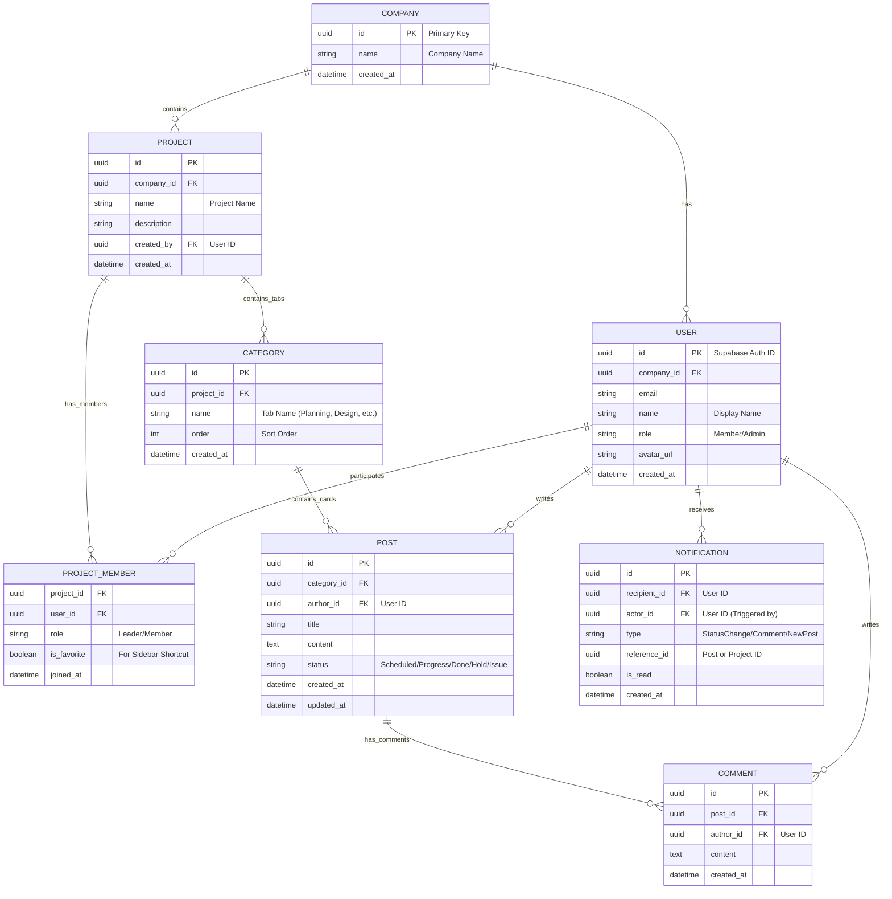

# MiniCrew Database Schema (ERD)

## Schema Description

### 1. Users & Auth (Supabase Auth)
- **Profile Table**: Maps to Supabase `auth.users` via `id`.
- **Company Context**: Currently assumes single-tenant per deployment or filtered by `company_id` for multi-tenant (SaaS). We will use `company_id` to scope data access by RLS policies.

### 2. Project Hierarchy
- **Project Structure**: Groups -> Projects -> Categories (Tabs) -> Posts.
- **Categories**: This is the "Tab" feature requested (e.g., Planning, Design, Dev).

### 3. Post (Task/Card)
- **Status Field**: Enum-like string (`Scheduled`, `Progress`, `Done`, `Hold`, `Issue`).
- **Minimal Metadata**: Focus on core info (Title, Author, Status, Content) as per "Card Layout" request.

### 4. Interactions
- **Favorites**: Handled in `PROJECT_MEMBER` table with `is_favorite` flag.
- **Notifications**: Dedicated table for sync/async notifications on status changes or comments.

## Supabase Implementation Notes
- Use **RLS (Row Level Security)** policies to restrict access based on `company_id` and `project_member` status.
- Use **Triggers** to auto-create notifications on `UPDATE` of `post.status` or `INSERT` of `comment`.
